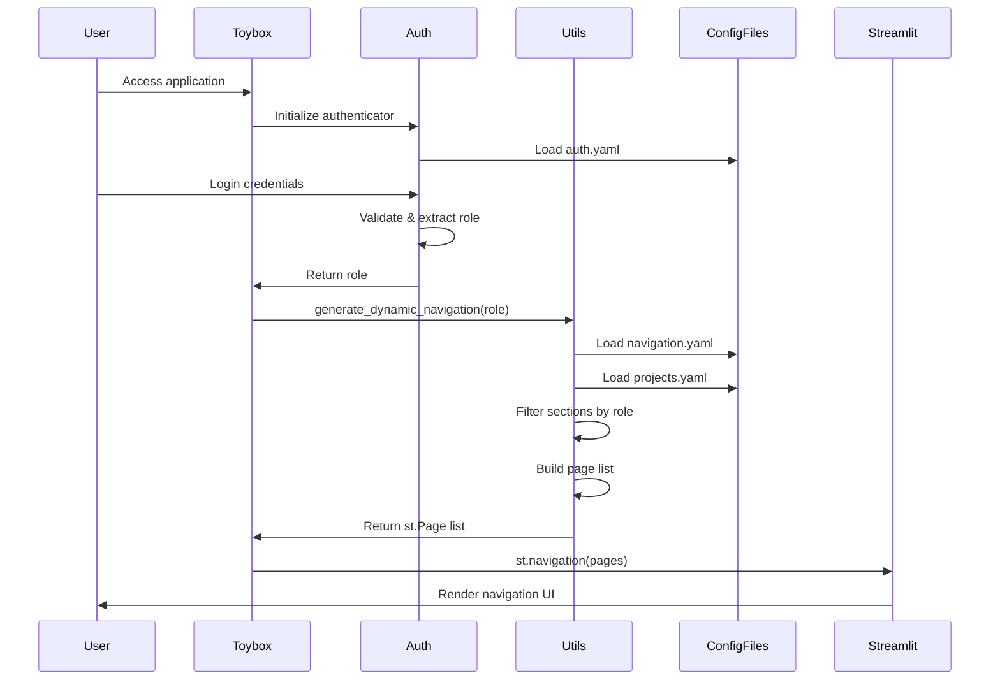
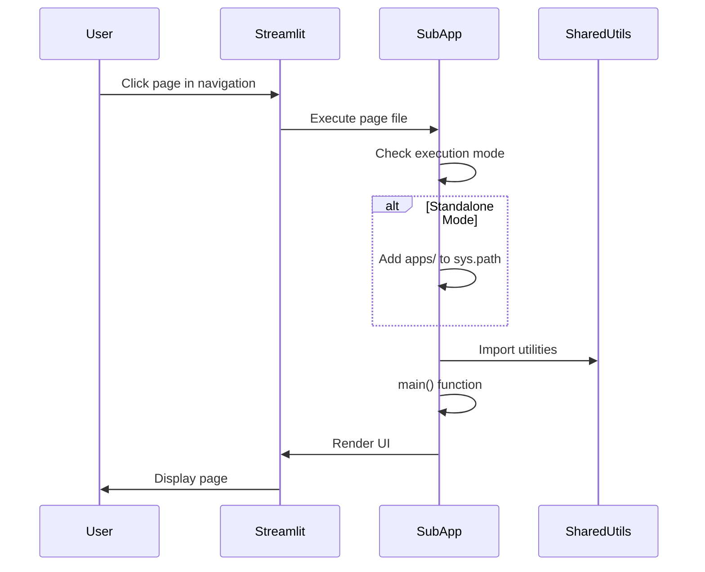

# Architecture Overview

Toybox 2.0 is built on a configuration-driven architecture that separates concerns into distinct layers, enabling scalable multi-page Streamlit applications with role-based access control.

## System Architecture

### High-Level Design

```
┌────────────────────────────────────────────────────────┐
│                     User Browser                       │
│                  (http://localhost:8501)               │
└───────────────────────┬────────────────────────────────┘
                        │
                        ▼
┌────────────────────────────────────────────────────────┐
│                    toybox.py                           │
│              (Main Entry Point)                        │
│  • Load logging configuration                          │
│  • Initialize authentication                           │
│  • Generate dynamic navigation                         │
└───────────────────────┬────────────────────────────────┘
                        │
                        ▼
┌────────────────────────────────────────────────────────┐
│              Streamlit Authenticator                   │
│  • User login/logout                                   │
│  • Session management                                  │
│  • Role extraction                                     │
└───────────────────────┬────────────────────────────────┘
                        │
                        ▼
┌────────────────────────────────────────────────────────┐
│        apps/shared/utils.generate_dynamic_navigation() │
│  • Load config/navigation.yaml                         │
│  • Load config/projects.yaml                           │
│  • Filter sections by user role                        │
│  • Build st.Page list                                  │
└───────────────────────┬────────────────────────────────┘
                        │
                        ▼
┌────────────────────────────────────────────────────────┐
│              st.navigation(pages)                      │
│  • Render navigation sidebar                           │
│  • Execute selected page                               │
└────────────────────────────────────────────────────────┘
                        │
                        ▼
┌────────────────────────────────────────────────────────┐
│              Individual Sub-Applications               │
│  apps/demo_app/main.py                                 │
│  apps/welcome/welcome.py                               │
│  apps/utilities/analyzer.py                            │
│  • Independent execution logic                         │
│  • Shared utility imports                              │
│  • Dual-mode support                                   │
└────────────────────────────────────────────────────────┘
```

## Core Components

### 1. Configuration Layer

**Purpose:** Define all applications, navigation, and access control through YAML files.

#### config/projects.yaml

Defines **application metadata** and **file paths**:

```yaml
projects:
  demo_apps:
    name: "Demo Applications"
    apps:
      demo_app:
        name: "Demo Application"
        path: "apps/demo_app/main.py"
        icon: "🎯"
        description: "Example Streamlit application"
```

**Structure:**
- `projects` - Top-level grouping (logical collections)
- `projects.<key>.name` - Display name for group
- `projects.<key>.apps` - Applications in this group
- `projects.<key>.apps.<app_key>` - Individual app configuration
  - `name` - Display name in navigation
  - `path` - Relative path to Python file
  - `icon` - Emoji or icon for UI
  - `description` - App description

#### config/navigation.yaml

Defines **navigation structure** and **role permissions**:

```yaml
roles:
  admin:
    sections:
      - welcome
      - demo_apps
      - utilities
      - system
  developer:
    sections:
      - welcome
      - demo_apps
      - utilities

sections:
  welcome:
    title: "🏠 Welcome"
    pages:
      - welcome.welcome_page
  demo_apps:
    title: "🎯 Demo Applications"
    pages:
      - demo_apps.demo_app
      - demo_apps.another_demo
```

**Structure:**
- `roles` - Defines user role permissions
- `roles.<role>.sections` - List of accessible sections
- `sections` - Navigation section definitions
- `sections.<key>.title` - Section header in sidebar
- `sections.<key>.pages` - Pages in section (format: `project.app`)

#### config/auth.yaml

Manages **user credentials** and **authentication**:

```yaml
credentials:
  usernames:
    admin:
      email: admin@example.com
      name: Admin User
      password: $2b$12$...  # bcrypt hash
      role: admin

cookie:
  expiry_days: 30
  key: secret_key_here
  name: toybox_auth_cookie

preauthorized:
  emails:
    - admin@example.com
```

**Structure:**
- `credentials.usernames` - User account definitions
- `credentials.usernames.<username>.role` - Determines access level
- `cookie` - Session management configuration
- `preauthorized.emails` - Pre-approved email addresses

### 2. Application Layer

**Purpose:** Main entry point and orchestration logic.

#### toybox.py

```python
import streamlit as st
import streamlit_authenticator as stauth
import yaml
import logging.config

# 1. Configure logging
logging.config.fileConfig('logging.ini')

# 2. Load authentication configuration
with open('config/auth.yaml') as file:
    config = yaml.safe_load(file)

# 3. Initialize authenticator
authenticator = stauth.Authenticate(
    config['credentials'],
    config['cookie']['name'],
    config['cookie']['key'],
    config['cookie']['expiry_days']
)

# 4. Render login widget
name, authentication_status, username = authenticator.login('Login', 'main')

# 5. Handle authentication states
if authentication_status:
    # Get user role
    role = config['credentials']['usernames'][username]['role']
    
    # Generate dynamic navigation
    from apps.shared.utils import generate_dynamic_navigation
    pages = generate_dynamic_navigation(role)
    
    # Render navigation
    pg = st.navigation(pages)
    pg.run()
    
    # Add logout button
    authenticator.logout('Logout', 'sidebar')
```

**Responsibilities:**
1. Load and configure logging
2. Initialize authentication system
3. Handle login/logout flow
4. Determine user role
5. Generate role-based navigation
6. Render selected page

### 3. Shared Utilities Layer

**Purpose:** Common functionality used across applications.

#### apps/shared/utils.py

**Dynamic Navigation Generator:**

```python
import streamlit as st
import yaml
from pathlib import Path

def generate_dynamic_navigation(role: str) -> list:
    """Generate navigation pages based on user role.
    
    Args:
        role: User role (admin, developer, analyst, viewer)
        
    Returns:
        List of st.Page objects for Streamlit navigation
    """
    # Load configuration files
    with open('config/projects.yaml') as f:
        projects = yaml.safe_load(f)
    
    with open('config/navigation.yaml') as f:
        navigation = yaml.safe_load(f)
    
    # Get sections authorized for this role
    authorized_sections = navigation['roles'].get(role, {}).get('sections', [])
    
    pages = []
    
    for section_key in authorized_sections:
        section = navigation['sections'][section_key]
        
        for page_ref in section['pages']:
            # Parse page reference: "project.app"
            project_key, app_key = page_ref.split('.')
            
            # Get app configuration
            app_config = projects['projects'][project_key]['apps'][app_key]
            
            # Create Streamlit page
            pages.append(st.Page(
                page=app_config['path'],
                title=app_config['name'],
                icon=app_config['icon']
            ))
    
    return pages
```

**Key Features:**
- No hardcoded page references
- Completely configuration-driven
- Easy to add/remove pages
- Automatic role-based filtering

#### apps/shared/constants.py

```python
"""Shared constants across applications."""

APP_TITLE = "Toybox 2.0"
VERSION = "2.0.0"

# Database connections, API endpoints, etc.
```

### 4. Sub-Application Layer

**Purpose:** Independent applications with dual-mode execution.

#### Sub-App Structure

```
apps/my_app/
├── main.py          # Entry point
├── utils.py         # App-specific utilities
├── components.py    # UI components
└── README.md        # App documentation
```

#### Dual-Mode Execution Pattern

```python
import streamlit as st
import sys
from pathlib import Path

# Enable standalone execution
if __name__ == "__main__":
    apps_dir = str(Path(__file__).parent.parent)
    if apps_dir not in sys.path:
        sys.path.insert(0, apps_dir)

# Imports work in both modes
from shared.utils import some_utility
from shared.constants import APP_TITLE

def main():
    """Main application logic."""
    st.title("My Application")
    st.write("Application content")

if __name__ == "__main__":
    # Standalone mode: python apps/my_app/main.py
    main()
else:
    # Integrated mode: called by Streamlit navigation
    main()
```

**Benefits:**
- Test applications independently
- Faster development iteration
- Isolated debugging
- No authentication overhead during development

## Data Flow

### Navigation Generation Flow



### Page Execution Flow



## Design Principles

### 1. Configuration Over Code

**Principle:** All structural decisions should be in configuration files, not Python code.

**Example:**
```python
# ❌ Bad - hardcoded pages
pages = [
    st.Page("apps/welcome.py", title="Welcome"),
    st.Page("apps/demo.py", title="Demo")
]

# ✅ Good - configuration-driven
pages = generate_dynamic_navigation(user_role)
```

### 2. Separation of Concerns

**Principle:** Each layer has distinct responsibilities.

| Layer | Responsibility | Location |
|-------|---------------|----------|
| **Configuration** | Define structure | `config/*.yaml` |
| **Application** | Orchestration | `toybox.py` |
| **Shared Utilities** | Common functions | `apps/shared/` |
| **Sub-Apps** | Business logic | `apps/*/` |

### 3. Dual-Mode Execution

**Principle:** All sub-apps must work standalone and integrated.

**Implementation:**
```python
if __name__ == "__main__":
    # Standalone setup
    sys.path.insert(0, str(Path(__file__).parent.parent))
    main()
else:
    # Integrated mode
    main()
```

### 4. Role-Based Access Control

**Principle:** Access is determined by role, not user.

**Flow:**
1. User authenticates → Role extracted
2. Role defines sections → Sections define pages
3. Only authorized pages rendered

### 5. Import Pattern Consistency

**Principle:** Always use absolute imports from `apps/` directory.

```python
# ✅ Correct
from shared.utils import generate_navigation
from demo_app.utils import process_data

# ❌ Incorrect
from ..shared.utils import generate_navigation
from .utils import process_data
```

## Technology Stack

### Core Technologies

| Technology | Version | Purpose |
|-----------|---------|---------|
| **Python** | 3.12+ | Programming language |
| **UV** | Latest | Package manager |
| **Streamlit** | Latest | Web framework |
| **streamlit-authenticator** | Latest | Authentication |
| **PyYAML** | Latest | Configuration parsing |
| **bcrypt** | Latest | Password hashing |

### Optional Dependencies

| Package | Purpose | Install With |
|---------|---------|-------------|
| **MkDocs** | Documentation | `uv sync --extra docs` |
| **mkdocstrings** | API docs | `uv sync --extra docs` |
| **Plotly** | Visualizations | `uv add plotly` |
| **Pandas** | Data manipulation | Core dependency |

## Security Considerations

### Authentication

- **Passwords:** Stored as bcrypt hashes
- **Sessions:** Cookie-based with expiration
- **Secret Key:** Configurable cookie key for session encryption

### Authorization

- **Role-Based:** Access controlled by role assignment
- **Configuration-Driven:** No code changes for permission updates
- **Section-Based:** Granular control at section level

### Best Practices

1. **Never commit `auth.yaml` with real credentials** - use templates
2. **Change default cookie key** in production
3. **Use strong passwords** and proper bcrypt hashes
4. **Limit role permissions** to minimum required
5. **Rotate session keys** periodically

## Performance Considerations

### Streamlit Caching

Use `@st.cache_data` for expensive operations:

```python
@st.cache_data
def load_large_dataset():
    return pd.read_csv('large_file.csv')
```

### Configuration Loading

Configuration files are loaded once per session, not per page navigation.

### Sub-App Isolation

Each sub-app runs independently - heavy processing in one app doesn't impact others.

## Extensibility

### Adding New Features

1. **New Sub-App:** Add to `apps/`, configure in YAML files
2. **New Role:** Define in `navigation.yaml`, assign sections
3. **New Section:** Define in `navigation.yaml`, add pages
4. **New Shared Utility:** Add to `apps/shared/utils.py`

### Plugin Architecture

While not formally a plugin system, the configuration-driven design allows:

- **Hot-swapping apps** via configuration changes
- **Conditional features** based on environment
- **Multiple deployment configurations** with different YAML files

## Deployment

### Development

```bash
# Run Toybox application
uv run --python 3.12 toybox.py

# Test documentation locally
uv sync --extra docs
uv run mkdocs serve              # http://localhost:8000
uv run mkdocs serve -a 0.0.0.0:8011  # http://<your-ip>:8011
```

### Production

**Docker:**
```dockerfile
FROM python:3.12-slim
WORKDIR /app
COPY . .
RUN pip install uv
RUN uv sync
CMD ["uv", "run", "--python", "3.12", "toybox.py"]
```

**Systemd Service:**
```ini
[Unit]
Description=Toybox 2.0
After=network.target

[Service]
Type=simple
User=toybox
WorkingDirectory=/opt/toybox2
ExecStart=/usr/local/bin/uv run --python 3.12 toybox.py

[Install]
WantedBy=multi-user.target
```

## Related Documentation

- **[Sub-App Development](../SUB_APP_DEVELOPMENT_GUIDE.md)** - Creating applications
- **[Quick Start Guide](../getting-started/quick-start.md)** - Installation and setup
- **[Adding Sub-Applications](../tutorials/adding-sub-app.md)** - Step-by-step tutorial
