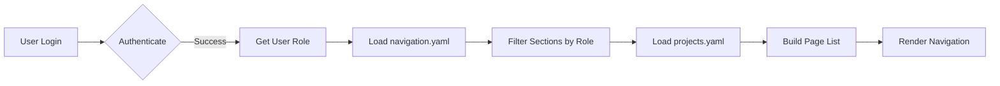

# Quick Start Guide

Get up and running with Toybox 2.0 in minutes.

## Prerequisites

- **Python 3.12+** installed
- **Git** for cloning the repository
- Basic understanding of YAML configuration files
- Familiarity with Streamlit (helpful but not required)

## Installation

### Step 1: Install UV Package Manager

UV is a modern, blazing-fast Python package manager written in Rust.

=== "Linux/macOS"
    ```bash
    curl -LsSf https://astral.sh/uv/install.sh | sh
    ```

=== "Windows"
    ```powershell
    powershell -c "irm https://astral.sh/uv/install.ps1 | iex"
    ```

=== "With pip"
    ```bash
    pip install uv
    ```

Verify installation:
```bash
uv --version
```

### Step 2: Clone Repository

```bash
cd /opt/projects  # Or your preferred directory
git clone <repository-url> toybox2
cd toybox2
```

### Step 3: Install Dependencies

=== "Core Only"
    ```bash
    # Install essential dependencies
    uv sync
    ```

=== "All Features"
    ```bash
    # Install everything including optional sub-apps
    uv sync --all-extras
    ```

=== "Selective Install"
    ```bash
    # Install core + specific features
    uv sync --extra demo_app --extra docs
    ```

This creates a virtual environment in `.venv/` and installs all configured packages.

## Configuration

### Step 1: Understand Configuration Files

Toybox 2.0 uses three main configuration files:

```
config/
├── projects.yaml      # Application metadata and file paths
├── navigation.yaml    # Navigation structure and role permissions
└── auth.yaml         # User credentials and authentication
```

### Step 2: Configure Authentication

Create `config/auth.yaml`:

```yaml
credentials:
  usernames:
    admin:
      email: admin@example.com
      name: Admin User
      password: $2b$12$LQv3c1yqBWVHxkd0LHAkCOYz6TtxMQJqhN8/LewY5UpWWaem.Nfua  # "admin"
      role: admin
    developer:
      email: dev@example.com
      name: Developer User
      password: $2b$12$LQv3c1yqBWVHxkd0LHAkCOYz6TtxMQJqhN8/LewY5UpWWaem.Nfua  # "password"
      role: developer

cookie:
  expiry_days: 30
  key: random_secret_key_change_this_in_production
  name: toybox_auth_cookie

preauthorized:
  emails:
    - admin@example.com
```

!!! warning "Security"
    **Important:** The passwords above are examples. Generate your own bcrypt hashes:
    
    ```python
    import streamlit_authenticator as stauth
    hashed = stauth.Hasher(['your_password']).generate()
    print(hashed[0])
    ```
    
    Change the `cookie.key` to a random string in production!

### Step 3: Verify Configuration Files

Check that `config/projects.yaml` and `config/navigation.yaml` exist:

```bash
ls -la config/
```

You should see:
- `projects.yaml` - Defines available applications
- `navigation.yaml` - Defines navigation structure
- `auth.yaml` - Your authentication configuration

## Running Toybox

### Start the Application

```bash
uv run --python 3.12 toybox.py
```

You should see:
```
You can now view your Streamlit app in your browser.

Local URL: http://localhost:8501
Network URL: http://192.168.1.x:8501
```

### Access the Application

1. Open your browser to `http://localhost:8501`
2. You'll see the login page
3. Use credentials from your `auth.yaml`:
   - **Username:** `admin`
   - **Password:** `admin` (or whatever you configured)

### Explore the Interface

After logging in:

1. **Welcome Page** - Introduction and overview
2. **Demo Applications** - Example sub-applications
3. **Navigation Sidebar** - Role-based page access
4. **Logout** - Available in sidebar

## Understanding the Structure

### Application Layout

```
toybox2/
├── config/               # Configuration files
│   ├── auth.yaml        # Authentication
│   ├── navigation.yaml  # Navigation structure
│   └── projects.yaml    # Application definitions
├── apps/                # Sub-applications
│   ├── shared/         # Shared utilities
│   ├── welcome/        # Welcome page
│   └── demo_app/       # Demo application
├── docs/               # Documentation
├── toybox.py          # Main entry point
└── pyproject.toml     # Project configuration
```

### Configuration Flow



1. User authenticates with credentials from `auth.yaml`
2. System determines user role
3. `navigation.yaml` defines which sections the role can access
4. `projects.yaml` provides metadata for each page
5. Dynamic navigation is generated

## Next Steps

<div class="grid cards" markdown>

-   :material-code-braces:{ .lg .middle } **Create Your First Sub-App**

    ---

    Learn to develop and integrate new applications
    
    [:octicons-arrow-right-24: Sub-App Development Guide](../SUB_APP_DEVELOPMENT_GUIDE.md)

-   :material-cog:{ .lg .middle } **Customize Configuration**

    ---

    Understand system architecture
    
    [:octicons-arrow-right-24: Architecture Overview](../architecture/overview.md)

-   :material-file-tree:{ .lg .middle } **Architecture Deep Dive**

    ---

    Understand the system design
    
    [:octicons-arrow-right-24: Architecture Overview](../architecture/overview.md)

</div>

## Quick Reference

### Common Commands

```bash
# Start Toybox
uv run --python 3.12 toybox.py

# Install new dependency
uv add package-name

# Update dependencies
uv sync --upgrade

# Run standalone sub-app
python apps/demo_app/main.py
streamlit run apps/demo_app/main.py

# View documentation locally
uv sync --extra docs
uv run mkdocs serve                    # localhost only
uv run mkdocs serve -a 0.0.0.0:8011    # all network interfaces
```

### Configuration Quick Edit

```bash
# Edit user credentials
nano config/auth.yaml

# Edit navigation structure
nano config/navigation.yaml

# Edit application metadata
nano config/projects.yaml

# Restart Toybox to apply changes
# (Ctrl+C to stop, then rerun toybox.py)
```

## Troubleshooting

### Cannot Import Streamlit

**Problem:** `ModuleNotFoundError: No module named 'streamlit'`

**Solution:**
```bash
uv sync  # Reinstall dependencies
```

### Login Page Not Showing

**Problem:** Blank page or error on startup

**Solution:**
1. Check `config/auth.yaml` exists
2. Verify YAML syntax (no tabs, proper indentation)
3. Check console for error messages

### Navigation Not Appearing

**Problem:** Logged in but no pages visible

**Solution:**
1. Verify user role in `auth.yaml`
2. Check role has sections in `navigation.yaml`
3. Ensure page paths in `projects.yaml` are correct

### Import Errors in Sub-Apps

**Problem:** `ModuleNotFoundError: No module named 'shared'`

**Solution:**
Ensure sub-app includes sys.path setup:
```python
import sys
from pathlib import Path

if __name__ == "__main__":
    apps_dir = str(Path(__file__).parent.parent)
    if apps_dir not in sys.path:
        sys.path.insert(0, apps_dir)
```

## Getting Help

- **[Architecture Documentation](../architecture/overview.md)** - Understand the system
- **[Sub-App Development Guide](../SUB_APP_DEVELOPMENT_GUIDE.md)** - Development patterns
- **[Adding Sub-Applications](../tutorials/adding-sub-app.md)** - Step-by-step tutorial
- **[GitHub Issues](https://github.com/liam-hsieh/toybox2/issues)** - Report bugs

---

!!! success "You're Ready!"
    You now have a working Toybox 2.0 installation. Start exploring the demo applications or create your own sub-app!

!!! tip "Development Mode"
    For faster development, run sub-apps standalone:
    ```bash
    python apps/demo_app/main.py
    ```
    This bypasses authentication and navigation for quick testing.
