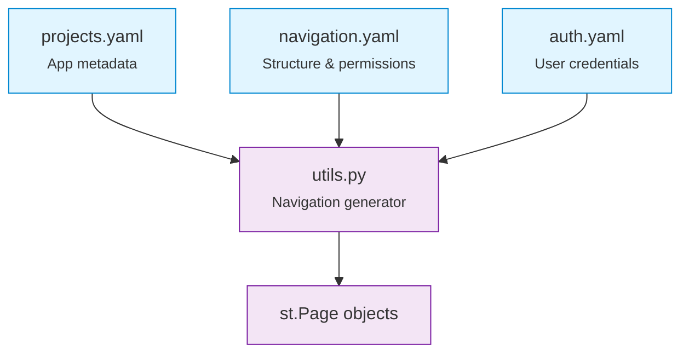

# Toybox 2.0 Documentation

Welcome to **Toybox 2.0** - a modern, production-ready framework for building scalable multi-page Streamlit applications with role-based access control and dynamic YAML-based navigation.

## What is Toybox 2.0?

Toybox 2.0 is a sophisticated application framework that transforms Streamlit into an enterprise-ready platform for hosting multiple sub-applications with centralized authentication, dynamic navigation, and modular architecture.

### Key Features

=== "Dynamic Navigation"
    **Configuration-Driven Routing**
    
    - Zero hardcoded navigation logic
    - Complete YAML-based configuration
    - Automatic page generation from config files
    - Easy addition/removal of applications
    
    ```yaml
    # config/navigation.yaml
    sections:
      demo_apps:
        title: "🎯 Demo Applications"
        pages:
          - demo_apps.demo_app
    ```

=== "Role-Based Access"
    **Multi-Role Authorization**
    
    - Supports admin, developer, analyst, viewer roles
    - Section-based permission system
    - Configuration-driven access control
    - Centralized user management
    
    ```yaml
    # config/navigation.yaml
    roles:
      admin:
        sections: [welcome, demo_apps, utilities, system]
      developer:
        sections: [welcome, demo_apps, utilities]
    ```

=== "Modular Sub-Apps"
    **Independent Applications**
    
    - Dual-mode execution (standalone + integrated)
    - Clean separation of concerns
    - Reusable component architecture
    - Easy testing and development
    
    ```python
    # Run standalone for testing
    python apps/demo_app/main.py
    
    # Or integrated through Toybox
    python toybox.py
    ```

=== "Modern Stack"
    **Fast & Reliable**
    
    - UV package manager (10-100x faster)
    - Python 3.12+ support
    - Streamlit native multipage
    - Optional dependency groups
    
    ```bash
    # Install core dependencies
    uv sync
    
    # Install with optional features
    uv sync --all-extras
    ```

## Quick Start

```bash
# 1. Install UV package manager
curl -LsSf https://astral.sh/uv/install.sh | sh

# 2. Install dependencies
cd toybox2
uv sync --all-extras

# 3. Configure authentication (create config/auth.yaml)
# See getting-started guide for details

# 4. Run Toybox
uv run --python 3.12 toybox.py

# Access at http://localhost:8501
```

## Architecture Overview

Toybox 2.0 uses a three-tier configuration system:



**Configuration Flow:**

1. **User authenticates** → Role determined from `auth.yaml`
2. **Navigation generated** → Based on role permissions in `navigation.yaml`
3. **Pages rendered** → Using metadata from `projects.yaml`

## Navigation

<div class="grid cards" markdown>

-   **:material-clock-fast: Getting Started**

    ---

    Quick installation and first-time setup
    
    [Quick Start :octicons-arrow-right-24:](getting-started/quick-start.md)

-   **:material-file-tree: Architecture**

    ---

    System design and configuration system
    
    [Architecture Guide :octicons-arrow-right-24:](architecture/overview.md)

-   **:material-code-braces: Sub-App Development**

    ---

    Create and integrate new applications
    
    [Development Guide :octicons-arrow-right-24:](SUB_APP_DEVELOPMENT_GUIDE.md)

-   **:material-school: Tutorials**

    ---

    Step-by-step guides for common tasks
    
    [View Tutorials :octicons-arrow-right-24:](tutorials/adding-sub-app.md)

-   **:material-key: Environment Variables**

    ---

    Securely manage secrets with .env files
    
    [Environment Setup :octicons-arrow-right-24:](tutorials/environment-variables.md)

-   **:material-file-document-edit: Writing Documentation**

    ---

    Learn special syntax for beautiful docs
    
    [Writing Guide :octicons-arrow-right-24:](tutorials/documentation-writing.md)

-   **:material-api: API Documentation**

    ---

    Auto-generate API docs from source code
    
    [API Guide :octicons-arrow-right-24:](tutorials/api-documentation.md)

</div>

## Core Concepts

### Configuration-Driven Design

Everything is configured through YAML files - no hardcoded navigation or permissions:

```yaml
# config/projects.yaml - Define applications
projects:
  utilities:
    name: "Utility Tools"
    apps:
      data_analyzer:
        name: "Data Analyzer"
        path: "apps/utilities/analyzer.py"
        icon: "📊"

# config/navigation.yaml - Control visibility
sections:
  utilities:
    title: "🔧 Utilities"
    pages:
      - utilities.data_analyzer

roles:
  analyst:
    sections: [utilities]  # Analysts see utilities
```

### Dual-Mode Execution

All sub-applications work standalone and integrated:

```python
import sys
from pathlib import Path

# Enable standalone execution
if __name__ == "__main__":
    apps_dir = str(Path(__file__).parent.parent)
    if apps_dir not in sys.path:
        sys.path.insert(0, apps_dir)

from shared.utils import some_utility

def main():
    # Application logic
    pass

if __name__ == "__main__":
    main()  # Standalone
else:
    main()  # Integrated via Toybox
```

### Import Patterns

Use absolute imports from the `apps/` directory:

```python
# ✅ Correct - absolute imports from apps/
from shared.utils import generate_navigation
from shared.constants import APP_TITLE
from demo_app.utils import process_data

# ❌ Avoid - relative imports fail in integrated mode
from ..shared.utils import something
from .utils import local_function
```

## Why Toybox 2.0?

| Feature | Traditional Streamlit | Toybox 2.0 |
|---------|----------------------|------------|
| **Navigation** | Hardcoded in Python | YAML configuration |
| **Access Control** | Manual implementation | Built-in role-based |
| **Sub-Apps** | Tightly coupled | Independent modules |
| **Testing** | Complex setup | Dual-mode execution |
| **Deployment** | Single app | Multi-app platform |
| **Configuration** | Environment variables | Structured YAML |

## Example Use Cases

- **Enterprise Analytics Platform** - Host multiple analytics dashboards with role-based access
- **Internal Tools Suite** - Consolidate departmental tools under unified authentication
- **Data Science Workbench** - Collection of modeling, visualization, and reporting tools
- **Development Sandbox** - Isolated environments for testing and development

## Resources

- **[Sub-App Development Guide](SUB_APP_DEVELOPMENT_GUIDE.md)** - Comprehensive guide for creating sub-applications
- **[CMake Installation Guide](cmake_installation_guide.md)** - System dependency setup
- **[GitHub Repository](https://github.com/your-username/toybox2)** - Source code and issues
- **[Streamlit Documentation](https://docs.streamlit.io/)** - Streamlit framework reference
- **[UV Documentation](https://github.com/astral-sh/uv)** - Package manager guide

## Support & Contributing

Need help? Check out our:

- **[Sub-App Development Guide](SUB_APP_DEVELOPMENT_GUIDE.md)** - Comprehensive development guide
- **[GitHub Issues](https://github.com/liam-hsieh/toybox2/issues)** - Report bugs or request features

---

!!! tip "Getting Started"
    New to Toybox 2.0? Start with the [Quick Start Guide](getting-started/quick-start.md) to get up and running in minutes!


