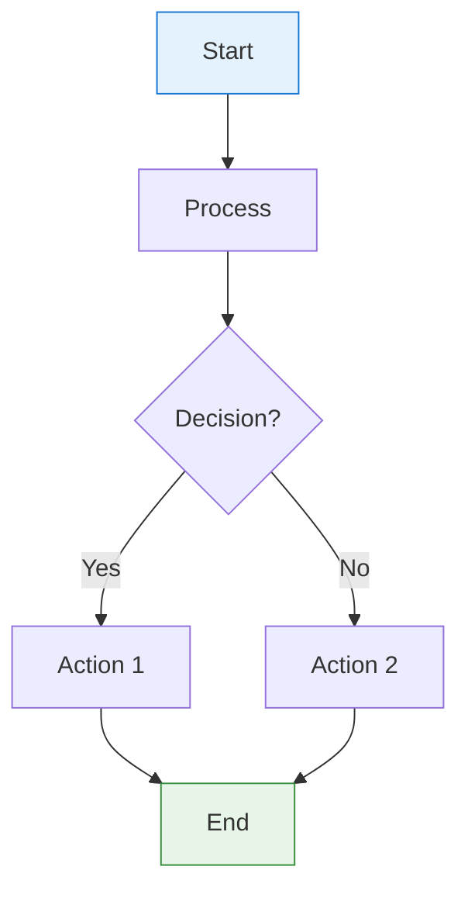
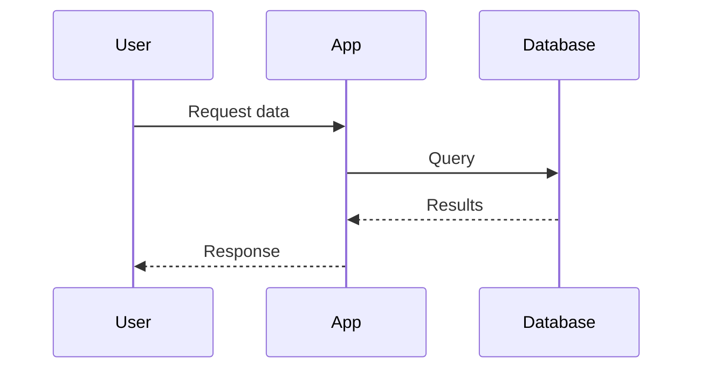
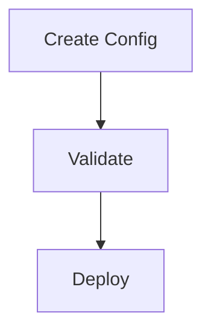

# Documentation Writing Guide

Learn how to create beautiful, feature-rich documentation using MkDocs Material theme extensions and special syntax.

## Overview

Toybox 2.0 documentation uses **MkDocs** with the **Material** theme, which provides powerful extensions beyond standard Markdown. This guide covers the special syntax and features available for creating professional documentation.

## Basic Markdown

### Standard Elements

```markdown
# Heading 1
## Heading 2
### Heading 3

**Bold text**
*Italic text*
~~Strikethrough~~

- Bullet list
- Another item

1. Numbered list
2. Second item

[Link text](url)


`inline code`

```python
# Code block
def example():
    pass
```
```

## Admonitions (Callout Boxes)

Admonitions are special callout boxes that highlight important information.

### Basic Syntax

```markdown
!!! note "Optional Title"
    Content goes here.
    Use 4-space indentation.
    
    Can have multiple paragraphs.
```

### Available Types

=== "Note"
    ```markdown
    !!! note "Helpful Information"
        This is a note admonition. Use for general information.
    ```
    
    **Renders as:**
    
    !!! note "Helpful Information"
        This is a note admonition. Use for general information.

=== "Tip"
    ```markdown
    !!! tip "Pro Tip"
        Quick helpful advice for users.
    ```
    
    **Renders as:**
    
    !!! tip "Pro Tip"
        Quick helpful advice for users.

=== "Warning"
    ```markdown
    !!! warning "Caution"
        Important warnings about potential issues.
    ```
    
    **Renders as:**
    
    !!! warning "Caution"
        Important warnings about potential issues.

=== "Danger"
    ```markdown
    !!! danger "Critical"
        Critical warnings about dangerous operations.
    ```
    
    **Renders as:**
    
    !!! danger "Critical"
        Critical warnings about dangerous operations.

=== "Success"
    ```markdown
    !!! success "Well Done!"
        Positive confirmation messages.
    ```
    
    **Renders as:**
    
    !!! success "Well Done!"
        Positive confirmation messages.

=== "Info"
    ```markdown
    !!! info "Did You Know?"
        Additional contextual information.
    ```
    
    **Renders as:**
    
    !!! info "Did You Know?"
        Additional contextual information.

=== "Question"
    ```markdown
    !!! question "Common Question?"
        Frequently asked questions or help topics.
    ```
    
    **Renders as:**
    
    !!! question "Common Question?"
        Frequently asked questions or help topics.

### Collapsible Admonitions

Use `???` instead of `!!!` to make admonitions collapsible:

```markdown
??? note "Click to Expand"
    This content is hidden by default.
    Users can click to reveal it.

???+ note "Expanded by Default"
    This starts expanded but can be collapsed.
```

**Example:**

??? note "Click to Expand"
    This content is hidden by default.
    Users can click to reveal it.

???+ note "Expanded by Default"
    This starts expanded but can be collapsed.

## Content Tabs

Create tabbed content for platform-specific instructions or multiple options.

### Basic Syntax

```markdown
=== "Tab 1 Title"
    Content for first tab.
    Use 4-space indentation.

=== "Tab 2 Title"
    Content for second tab.
    
    Can include code blocks:
    ```bash
    command here
    ```

=== "Tab 3 Title"
    More content.
```

### Real-World Example

=== "Linux/macOS"
    ```bash
    # Install on Unix systems
    curl -LsSf https://astral.sh/uv/install.sh | sh
    ```

=== "Windows"
    ```powershell
    # Install on Windows
    powershell -c "irm https://astral.sh/uv/install.ps1 | iex"
    ```

=== "With pip"
    ```bash
    # Alternative installation
    pip install uv
    ```

**Source:**

```markdown
=== "Linux/macOS"
    ```bash
    # Install on Unix systems
    curl -LsSf https://astral.sh/uv/install.sh | sh
    ```

=== "Windows"
    ```powershell
    # Install on Windows
    powershell -c "irm https://astral.sh/uv/install.ps1 | iex"
    ```

=== "With pip"
    ```bash
    # Alternative installation
    pip install uv
    ```
```

## Grid Cards

Create responsive card layouts for navigation and feature highlights.

### Basic Syntax

```markdown
<div class="grid cards" markdown>

-   **:material-icon: Card Title**

    ---

    Card description text
    
    [Link Text :octicons-arrow-right-24:](url)

-   **:material-icon: Another Card**

    ---

    Another description
    
    [Link Text :octicons-arrow-right-24:](url)

</div>
```

### Real-World Example

<div class="grid cards" markdown>

-   **:material-rocket-launch: Getting Started**

    ---

    Quick installation and setup guide
    
    [Quick Start :octicons-arrow-right-24:](../getting-started/quick-start.md)

-   **:material-book-open: Tutorials**

    ---

    Step-by-step learning guides
    
    [Browse Tutorials :octicons-arrow-right-24:](adding-sub-app.md)

-   **:material-code-braces: API Reference**

    ---

    Complete API documentation
    
    [View API Docs :octicons-arrow-right-24:](api-documentation.md)

</div>

**Source:**

```markdown
<div class="grid cards" markdown>

-   **:material-rocket-launch: Getting Started**

    ---

    Quick installation and setup guide
    
    [Quick Start :octicons-arrow-right-24:](quick-start.md)

-   **:material-book-open: Tutorials**

    ---

    Step-by-step learning guides
    
    [Browse Tutorials :octicons-arrow-right-24:](adding-sub-app.md)

</div>
```

## Material Icons

Use Material Design and Octicons in your documentation.

### Icon Syntax

```markdown
:material-icon-name:        # Material Design icons
:octicons-icon-name-16:     # Octicons (16px)
:octicons-icon-name-24:     # Octicons (24px)
```

### Common Icons

| Icon Code | Renders | Use Case |
|-----------|---------|----------|
| `:material-check:` | :material-check: | Success/completion |
| `:material-close:` | :material-close: | Error/cancel |
| `:material-alert:` | :material-alert: | Warning |
| `:material-information:` | :material-information: | Information |
| `:material-rocket-launch:` | :material-rocket-launch: | Getting started |
| `:material-book-open:` | :material-book-open: | Documentation |
| `:material-code-braces:` | :material-code-braces: | Code/API |
| `:material-cog:` | :material-cog: | Configuration |
| `:material-key:` | :material-key: | Security/credentials |
| `:octicons-arrow-right-24:` | :octicons-arrow-right-24: | Navigation arrows |

### Finding More Icons

- **Material Icons:** https://pictogrammers.com/library/mdi/
- **Octicons:** https://primer.style/foundations/icons

## Code Blocks with Features

### Syntax Highlighting

````markdown
```python
def example():
    """Function with syntax highlighting."""
    return "Hello World"
```
````

### With Title

````markdown
```python title="example.py"
def example():
    return "File with title"
```
````

### With Line Numbers

````markdown
```python linenums="1"
def example():
    """Line numbers shown."""
    return True
```
````

### Highlighting Lines

````markdown
```python hl_lines="2 3"
def example():
    important_line = True  # Highlighted
    another_one = "Also highlighted"
    return important_line
```
````

**Result:**

```python hl_lines="2 3"
def example():
    important_line = True  # Highlighted
    another_one = "Also highlighted"
    return important_line
```

## Mermaid Diagrams

Create flowcharts, sequence diagrams, and more with Mermaid.

### Flowchart Example

````markdown

````

**Renders as:**


### Sequence Diagram

````markdown

````

**Renders as:**


### Tips for Mermaid

- Use `flowchart TB` (top-bottom) or `flowchart LR` (left-right)
- Keep node text short to avoid overflow
- Use `<br/>` for line breaks in nodes
- Use `<small>` tags for secondary text: `["Main<br/><small>Details</small>"]`
- Add colors with `style` commands

## Tables

### Basic Table

```markdown
| Header 1 | Header 2 | Header 3 |
|----------|----------|----------|
| Cell 1   | Cell 2   | Cell 3   |
| Cell 4   | Cell 5   | Cell 6   |
```

**Renders as:**

| Header 1 | Header 2 | Header 3 |
|----------|----------|----------|
| Cell 1   | Cell 2   | Cell 3   |
| Cell 4   | Cell 5   | Cell 6   |

### Aligned Columns

```markdown
| Left | Center | Right |
|:-----|:------:|------:|
| A    | B      | C     |
| 1    | 2      | 3     |
```

**Renders as:**

| Left | Center | Right |
|:-----|:------:|------:|
| A    | B      | C     |
| 1    | 2      | 3     |

## Advanced Features

### Nested Admonitions

You can nest admonitions inside each other:

```markdown
!!! note "Outer Note"
    Some content here.
    
    !!! tip "Inner Tip"
        Nested tip inside the note.
```

**Renders as:**

!!! note "Outer Note"
    Some content here.
    
    !!! tip "Inner Tip"
        Nested tip inside the note.

### Code in Admonitions

```markdown
!!! example "Code Example"
    Here's how to do it:
    
    ```python
    def example():
        return "Hello"
    ```
    
    Then run: `python example.py`
```

**Renders as:**

!!! example "Code Example"
    Here's how to do it:
    
    ```python
    def example():
        return "Hello"
    ```
    
    Then run: `python example.py`

### Keyboard Keys

Show keyboard shortcuts with `<kbd>` tags:

```markdown
Press <kbd>Ctrl</kbd> + <kbd>C</kbd> to copy.
Use <kbd>Cmd</kbd> + <kbd>V</kbd> on Mac.
```

**Renders as:**

Press <kbd>Ctrl</kbd> + <kbd>C</kbd> to copy.
Use <kbd>Cmd</kbd> + <kbd>V</kbd> on Mac.

## Best Practices

### Structure

1. **Start with H1** - One `#` heading per page
2. **Use H2 for sections** - `##` for main topics
3. **H3 for subsections** - `###` for details
4. **Don't skip levels** - Go from H2 → H3, not H2 → H4

### Content Organization

```markdown
# Page Title

Brief introduction paragraph.

## First Major Topic

Content explaining the topic.

### Subtopic A

Detailed information.

### Subtopic B

More details.

## Second Major Topic

Another major section.
```

### Admonition Usage

- **Note** - General information, FYI
- **Tip** - Helpful advice, best practices
- **Warning** - Caution, potential issues
- **Danger** - Critical warnings, data loss risks
- **Success** - Completion messages, achievements
- **Info** - Additional context, background
- **Question** - FAQs, help topics
- **Example** - Code examples, demonstrations

### Code Block Languages

Specify language for proper syntax highlighting:

- `python` - Python code
- `bash` - Shell commands
- `yaml` - YAML configuration
- `json` - JSON data
- `javascript` - JavaScript code
- `powershell` - PowerShell commands
- `sql` - SQL queries
- `markdown` - Markdown syntax
- `mermaid` - Diagrams

## Quick Reference

### Admonitions

```markdown
!!! type "Title"
    Content

Types: note, tip, warning, danger, success, info, question, example
```

### Tabs

```markdown
=== "Tab 1"
    Content

=== "Tab 2"
    Content
```

### Grid Cards

```markdown
<div class="grid cards" markdown>

-   **:icon: Title**
    ---
    Description
    [Link :octicons-arrow-right-24:](url)

</div>
```

### Icons

```markdown
:material-icon-name:
:octicons-icon-name-24:
```

### Mermaid

````markdown

````

### Code Features

````markdown
```python title="file.py" linenums="1" hl_lines="2 3"
code here
```
````

## Testing Your Documentation

### Build Locally

```bash
# Install documentation dependencies
uv sync --extra docs

# Serve documentation
uv run mkdocs serve

# Access at http://localhost:8000
```

### Check for Errors

```bash
# Strict build (fails on warnings)
uv run mkdocs build --clean --strict

# Check for broken links
uv run mkdocs build --strict 2>&1 | grep WARNING
```

## Common Issues

### Icons Not Showing

**Problem:** Icons display as `:material-icon:` instead of rendering

**Solution:** Ensure `pymdownx.emoji` is in `mkdocs.yml`:

```yaml
markdown_extensions:
  - pymdownx.emoji:
      emoji_index: !!python/name:material.extensions.emoji.twemoji
      emoji_generator: !!python/name:material.extensions.emoji.to_svg
```

### Tabs Not Working

**Problem:** Tabs show as plain list items

**Solution:** Check indentation (use 4 spaces) and ensure no blank lines between tabs.

### Mermaid Not Rendering

**Problem:** Mermaid shows as code block

**Solution:** Verify `pymdownx.superfences` with mermaid fence:

```yaml
markdown_extensions:
  - pymdownx.superfences:
      custom_fences:
        - name: mermaid
          class: mermaid
          format: !!python/name:pymdownx.superfences.fence_code_format
```

### Card Grid Not Styling

**Problem:** Cards show as plain list

**Solution:** 
1. Ensure `markdown` attribute: `<div class="grid cards" markdown>`
2. Use exact syntax with `---` separator
3. Check Material theme is active

## Example: Complete Tutorial Page

Here's a complete example combining multiple features:

```markdown
# Tutorial: Feature Name

Brief introduction to what this tutorial covers.

## Prerequisites

!!! info "Before You Start"
    Make sure you have:
    
    - Python 3.12+
    - UV package manager
    - Basic understanding of YAML

## Installation

=== "Linux/macOS"
    ```bash
    curl -LsSf https://example.com/install.sh | sh
    ```

=== "Windows"
    ```powershell
    irm https://example.com/install.ps1 | iex
    ```

## Quick Start

### Step 1: Setup

```python title="setup.py" linenums="1"
import example

def main():
    # Your code here
    pass
```

!!! tip "Pro Tip"
    Use virtual environments for isolation.

### Step 2: Configuration



## Common Issues

??? question "Import Error?"
    Make sure dependencies are installed:
    
    ```bash
    uv sync
    ```

## Next Steps

<div class="grid cards" markdown>

-   **:material-rocket: Advanced Topics**
    ---
    Deep dive into features
    [Learn More :octicons-arrow-right-24:](../architecture/overview.md)

-   **:material-api: API Reference**
    ---
    Complete API documentation
    [View API :octicons-arrow-right-24:](api-documentation.md)

</div>
```

## Related Resources

- **[MkDocs Material Documentation](https://squidfunk.github.io/mkdocs-material/)** - Complete reference
- **[Mermaid Documentation](https://mermaid.js.org/)** - Diagram syntax
- **[Material Icons](https://pictogrammers.com/library/mdi/)** - Icon library
- **[Markdown Guide](https://www.markdownguide.org/)** - Basic syntax

---

!!! success "Ready to Write!"
    You now know all the special syntax for creating beautiful documentation. Start writing!
